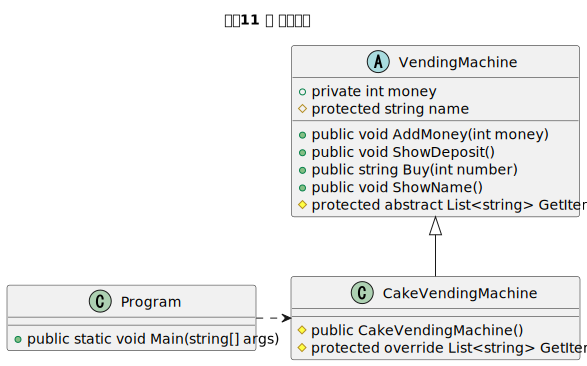

<div class="cover-container">
    <div class="cover-innner">
    <div class="title-wrapper"><h1 class="cover-title">ケーキ自動販売機<br>プログラム</h1></div>
                
    </div>
</div>

<style>
    .cover-title {
    text-align: center;
    font-size: 4em;
    }

    .cover-container {
    display: flex;
    justify-content: space-evenly;
    height: 100%;
    margin-top: 15%;
    margin-left: 20px;
    margin-right: 20px;
    page-break-after: always;
    text-align: center;
    font-size: 2em;
    }

    .cover-innner {
    display: flex;
    flex-direction: column;
    justify-content: center;
    gap: 10px;
    }

    .title-wrapper {
    width: 100%;
    }

    .title-wrapper h1 {
    font-size: 60px;
    }
</style>

<div style="page-break-before:always"></div>

<span>　</span>

<div style="page-break-before:always"></div>

### 問題1

ケーキという文字を10回出力してください。  
ただし、forのループ文を使用してください。

[出力イメージ]
```
ケーキ
ケーキ
ケーキ
ケーキ
ケーキ
ケーキ
ケーキ
ケーキ
ケーキ
ケーキ
```

### 問題2

Listにケーキを5個詰めて、foreach文を使って、すべて表示してください。  
また、最後に、箱の中のケーキの数を表示してください。(ListのCountを利用)
詰めるケーキは以下です。

チョコレートケーキ  
チーズケーキ  
モンブラン  
ショートケーキ  
まるやまケーキ  

[出力イメージ]

```
チョコレートケーキ  
チーズケーキ  
モンブラン  
ショートケーキ  
まるやまケーキ  
箱のケーキの数は、5個です。
```

<div style="page-break-before:always"></div>

### 問題3

以下のMainメソッドとBuyCakeメソッドをクラスの中に作成して、内部の処理を作成してください。  

``` C#
public static void Main(string[] args) 
{

}

private static string BuyCake(int number)
{
    
}
```

[BuyCakeメソッドの処理]

指定された番号のケーキが購入できるメソッドです。  
1が指定された場合、チョコレートケーキ  
2が指定された場合、チーズケーキ  
3が指定された場合、モンブラン  
を購入することができます。(対象のケーキを文字列で返す)

[Mainメソッドの処理]

BuyCakeメソッドを使用して、チョコレートケーキとモンブランを購入してください。  
購入したものは、出力してください。

[出力イメージ]
```
チョコレートケーキを購入しました。
モンブランを購入しました。
```

<div style="page-break-before:always"></div>

### 問題4

ReadLineメソッドを使用して、入力された番号のケーキを購入できるようにしましょう。

[出力イメージ]

```
どの番号のケーキを購入しますか？
1
チョコレートケーキを購入しました。
```

### 問題5

BuyCakeメソッドにお金を指定できるように引数を追加します。それぞれのケーキの値段は、チョコレートケーキ：500円　チーズケーキ：400円　モンブラン：400円 にしてください。

[出力イメージ]
```
お金を入れてください。
100
どの番号のケーキを購入しますか？
1
投入金額が不足しています。

お金を入れてください。
600
どの番号のケーキを購入しますか？
1
チョコレートケーキを購入しました。
```

### 問題6

問題5をケーキが購入できるまで繰り返すプログラムに変更してください。

[出力イメージ]
```
お金を入れてください。
100
どの番号のケーキを購入しますか？
1
投入金額が不足しています。(現在の投入金額は100円です。)

お金を入れてください。
400
どの番号のケーキを購入しますか？
1
チョコレートケーキを購入しました。
```

<div style="page-break-before:always"></div>

### 問題7

ケーキ自動販売機を作成します。  
CakeVendingMachineのクラスを新しく作成して、BuyCakeメソッドをこのクラスに移動してください。  
また、BuyCakeメソッドは、Buyメソッドに変更してください。  

出力イメージは、問題6と同じです。

[クラス図]


### 問題8

CakeVendingMachineクラスに、Moneyのプロパティを追加してください。  
また、Buyメソッドのお金の引数は削除して、Moneyプロパティを使用してください。

メインメソッドに関しては、Moneyプロパティに投入されたお金を入れてください。

出力イメージは、問題6と同じです。

[クラス図]


<div style="page-break-before:always"></div>

### 問題9

CakeVendingMachineクラスのMoneyプロパティをMoneyフィールド(private)に変更してください。  
また、CakeVendingMachineクラスにAddMoneyメソッド、ShowDepositメソッドを追加してください。

[クラス図]


[出力イメージ]

```
お金を入れてください。
100
現在の投入金額は、100円です。
どの番号のケーキを購入しますか？
1
投入金額が不足しています。

お金を入れてください。
400
現在の投入金額は、500円です。
どの番号のケーキを購入しますか？
1
チョコレートケーキを購入しました。
```

<div style="page-break-before:always"></div>

### 問題10

VendingMachineクラスを抽象クラスとして作成してください。  
CakeVendingMachineクラスの各メソッドは、VendingMachineクラスに移動してください。  

VendingMachineクラスには、以下のGetItemsを抽象メソッドとして定義してください。  
protected abstract List<string> GetItems();

CakeVendingMachineクラスでGetItemsメソッドをオーバーライドして実装してください。

返す商品は、3種類にしてください。

このGetItemsメソッドは、Buyメソッド内で使用してください。

出力イメージは、問題9と同じです。

[クラス図]


<div style="page-break-before:always"></div>

### 問題11

CakeVendingMachineクラスにコンストラクタを追加してください。  
VendingMachineクラスにnameフィールドを追加して、CakeVendingMachineクラスのコンストラクタで初期化してください。  
また、VendingMachineクラスにShowNameメソッドを追加して、自動販売機の名前を表示してください。

Mainメソッドでは、最初に、自動販売機の名前を表示してください。

[クラス図]



[出力イメージ]

```
これはケーキ自動販売機です。

お金を入れてください。
100
現在の投入金額は、100円です。
どの番号のケーキを購入しますか？
1
投入金額が不足しています。

お金を入れてください。
400
現在の投入金額は、500円です。
どの番号のケーキを購入しますか？
1
チョコレートケーキを購入しました。
```

<div style="page-break-before:always"></div>

### 問題12

他の好きな自動販売機を新しく作成してみましょう。

### 問題13

自販機の商品を、Itemクラスとして作成してみましょう。

※ おつりも表示してみましょう。
